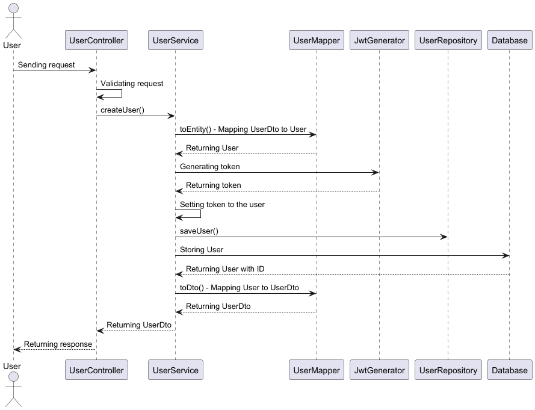
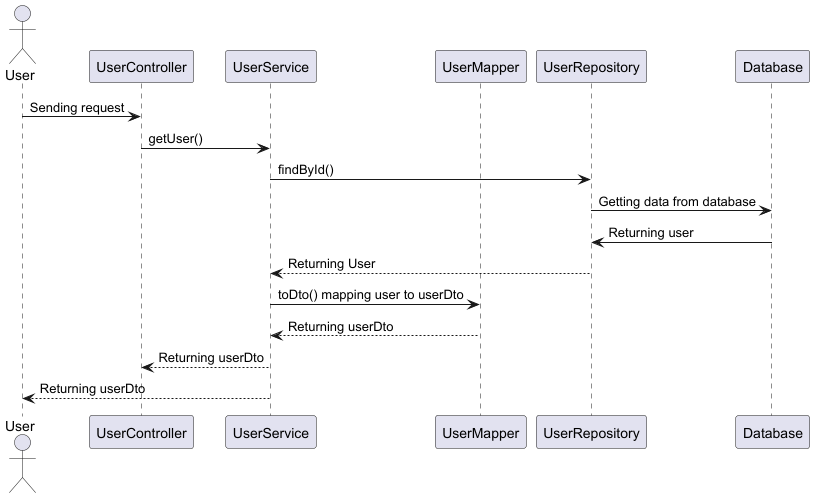
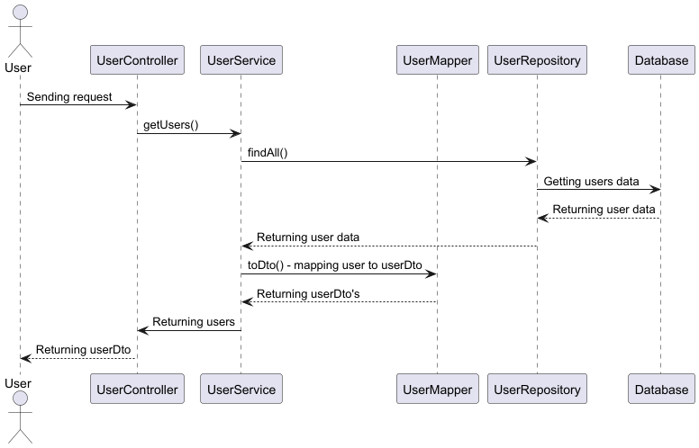
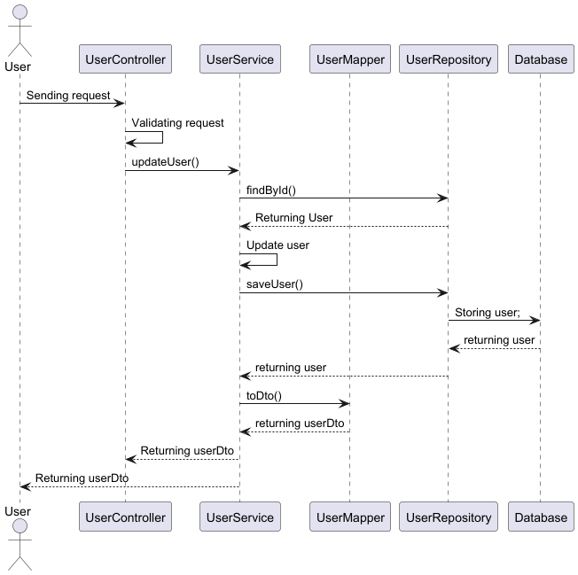
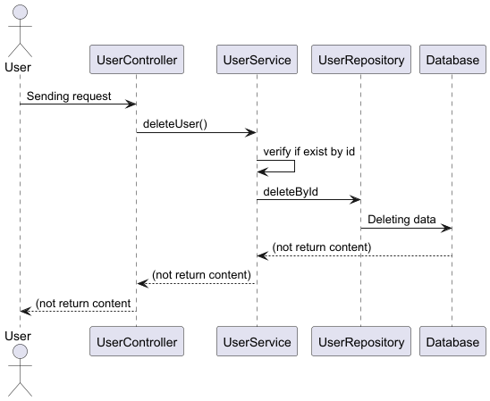

# User API

## Table Contents

### 1. [Project Description](#1-Project-description-1)
### 2. [Technologies used](#2-Technologies-used-1) 
### 3. [Requisites](#3-Requisites-1)
### 4. [How to run](#4-How-to-run-1)
### 5. [How to use](#5-How-to-use-1)
### 6. [Database definition and access](#6-Database-definition-and-access-1)
### 7. [Configurations](#7-Configurations-1)
### 8. [Solution diagrams](#8-solution-diagrams-1)

## 1. Project Description
This service exposing a REST endpoint to create new users and persist them in a database.

Note: There is also an endpoint to get the users created in order to validate the data, check **How to use** section.

## 2. Technologies used
- Java 21
- Spring boot 3.4.5
- Spring web
- Spring data
- H2 Database
- Maven
- Swagger / Spring doc 2.2.0
- Lombok
- Maven 3.9.5
- Mapstruct 1.5.5.Final
- jjwt-api 0.11.5

## 3. Requisites
- Java 21
- Maven 3.9.5
- Postman (Not required, but recommended)

## 4. How to run

This project only needs to execute the common spring boot command:

Execute `mvn spring-boot:run`

## 5. How to use

We have a 5 functions that you could use

Create User
Delete User
Get User
Get Users
Update User

Bellow you can see a `curl` with valid request and response, but also after running the project we can check the swagger documentation using this [link](http://localhost:8080/swagger-ui/index.htm)

```
## 6. Database definition and access

To consult the database after running the project you can check this [link](http://localhost:8080/h2-console)

To login user the username and password are on the application.yml file, properties: `spring.datasource.username` and `spring.datasource.password` and bellow you can see the initial definition of the tables, but also you can modify it in src/main/resources/schemma.sql

```declarative
CREATE TABLE IF NOT EXISTS app_user (
    id UUID PRIMARY KEY,
    name VARCHAR(100) NOT NULL,
    email VARCHAR(100) NOT NULL UNIQUE,
    password VARCHAR(100) NOT NULL,
    created TIMESTAMP NOT NULL DEFAULT CURRENT_DATE,
    modified TIMESTAMP NOT NULL DEFAULT CURRENT_DATE,
    last_login TIMESTAMP,
    is_active BOOLEAN DEFAULT TRUE,
    token VARCHAR(512) NOT NULL
);

CREATE TABLE IF NOT EXISTS phone (
    id UUID PRIMARY KEY,
    number VARCHAR(7) NOT NULL,
    city_code VARCHAR(1) NOT NULL,
    country_code VARCHAR(2) NOT NULL,
    user_id UUID NOT NULL,
    FOREIGN KEY (user_id) REFERENCES app_user(id)
);
```
## 7. ⚙️ Configurations

Here are the properties used in this project

| Property                                    | Description                                         | Example                                       |
|---------------------------------------------|-----------------------------------------------------|-----------------------------------------------|
| `spring.application.password-regex`         | Regex pattern for validating passwords.             | `must include letters, numbers`               |
| `spring.application.password-regex-message` | Message displayed if password not match             | `\d{7}`                                       |
| `spring.h2.console.enabled`                 | Enable console to consult database H2               | `true/false`                                  |
| `spring.h2.console.path`                    | Path to consult the database in a browser           | `/h2-console`                                 |
| `spring.datasource.url`                     | JDBC URL used to connect to the relational database | `h2:~/user-api`                               |
| `spring.datasource.username`                | Username to connect to the database                 | `admin`                                       |
| `spring.datasource.password`                | Password to connect to the database                 | `P@ssword!`                                   |
| `spring.sql.init.mode`           | Specifies when SQL initialization scripts should be executed| `always, embedded, never`                     |
| `spring.jpa.hibernate.ddl-auto`             | Controls how Hibernate handles the database schema at startup| `none, validate, update, create, create-drop` |


## 8. Solution diagrams

These diagrams show the different layers the requests thought to get the response and return it to the client

### Create user sequence Diagram


### Get user sequence Diagram


### Get users sequence Diagram


### Update user sequence Diagram


### Delete user sequence Diagram
